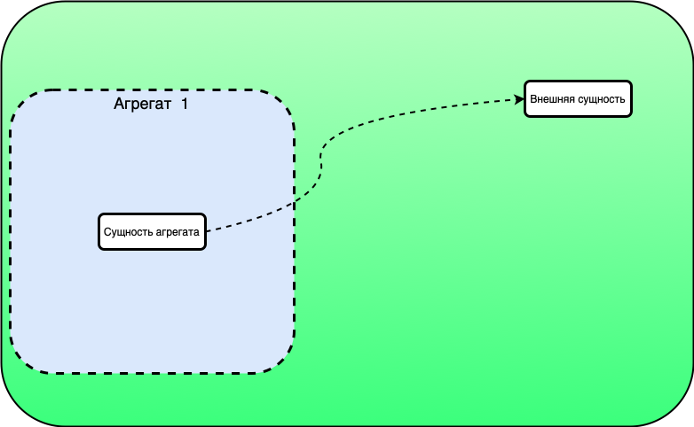
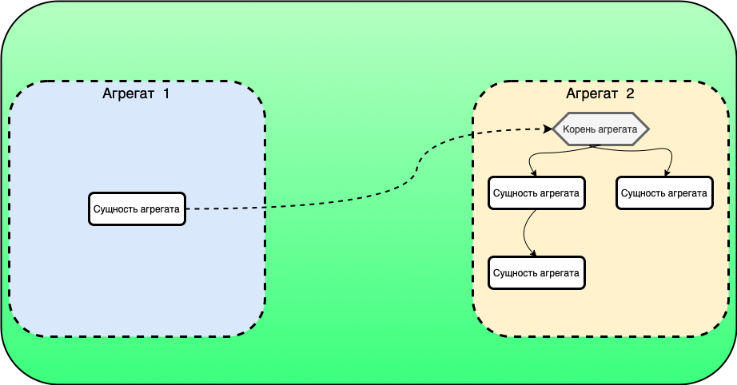
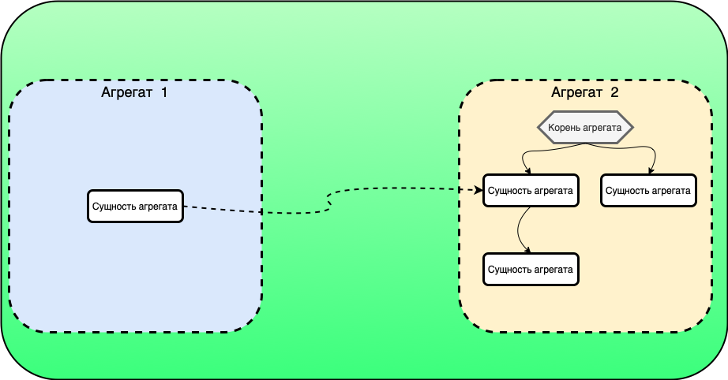
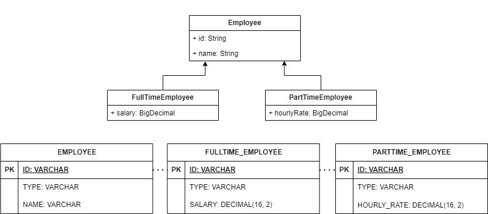
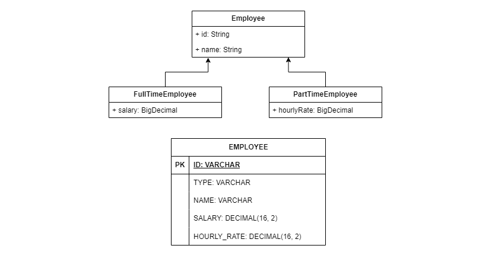
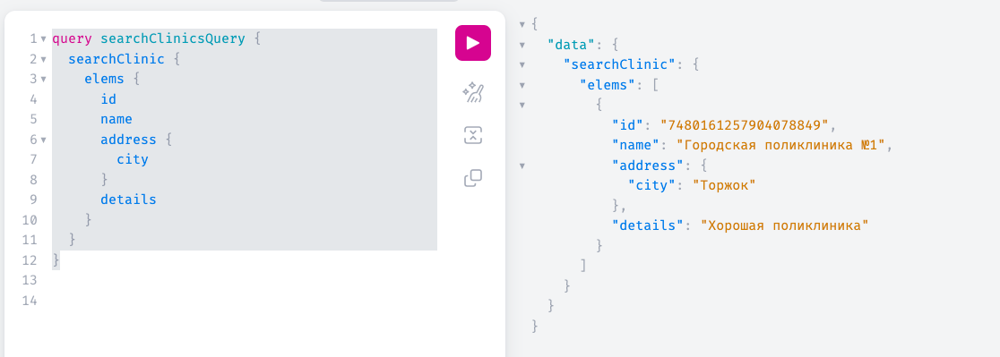

# Руководство по ведению модели данных Platform V DataSpace Community Edition


## О документе

DataSpace Community Edition (далее - DataSpace) предоставляет возможность создания модели данных предметной области вашего приложения в XML-нотации. На основе данного описания модели генерируется набор артефактов, необходимый для работы сервиса. В данном документе приведено подробное описание основных правил создания и изменения моделей DataSpace.


## О модели данных

DataSpace позволяет создавать модель данных в формате XML. Модель включает в себя объекты (сущности) предметной области, а также связи между ними. В основе подхода DataSpace к проектированию модели лежит концепция предметно-ориентированного проектирования (DDD). В соответствии с ней модель предметной области формируется из т.н. **агрегатов**, представляющих собой группу связанных сущностей, объединенных общей логикой взаимодействия. Для построения корректной и расширяемой модели необходимо правильно определять сущности, входящие в агрегаты, а также связи между ними. Дополнительную информацию по DDD можно найти в разделе [Агрегаты](#агрегаты).


## Создание модели данных


### Общее описание модели предметной области

Основным файлом модели является файл **model.xml**.
Файл модели включает в себя XML-элементы, заданные с помощью **тегов**. При разметке файла модели необходимо использовать следующие правила:

* Все элементы модели заключаются между парой тегов `<model></model>`
* Для типов сущностей необходимо использовать теги `<class></class>` (открывающие и закрывающие)
* Для свойств классов используются теги `<property/>`
* Индексируемые свойства помещаются между тегами `<index></index>`

Ниже показана упрощенная иерархия тегов в модели:

```xml

<model>
    <class>
        <property>
        <index>
        ...

```

### Основные шаги написания модели предметной области:

1. В файле **model.xml** добавьте теги модели ```<model></model>```, задайте их атрибуты. Подробнее об атрибутах тега model см. в разделе ["Тег Модель"](#тег-модель)
2. Добавьте в файл модели описание классов и их свойств. Подробнее - [Тег Класс](#тег-класс) и [Тег Свойство](#тег-свойство)
3. Определите связи между классами модели. Подробнее - [Связи между классами](#связи-между-классами)
4. Создайте необходимые агрегаты. Подробнее -  [Агрегаты](#агрегаты)

Создание файла model.xml также можно начать с редактирования следующего шаблона, который включает основные теги:

 ```xml
 <model>
     <class label="Краткое описание сущности" name="ClassName">
         <property label="Краткое описание свойств" name="propertyName" type="String"/>
         <index unique="false">
             <property name="propertyName"/>
         </index>
     </class>
 </model>
 ```

### Примеры моделей

* [Файла модели данных на примере сервиса "Медицинская клиника: запись на прием"](../files/resources/src-model/model.xml)


### Тег Модель

Содержимое данного тега должно быть заключено между парой тегов `<model></model>`

Обязательным атрибутом является `model-name`- название модели

Необязательные атрибуты:
* `description` — описание модели
* `version` — версия модели
* `table-prefix` — префикс, добавляемый элементам схема базы данных, в частности таблицам, индексам

Внутри тега `<model>` могут находиться следующие элементы:
* Классы сущностей
* Перечисления (Enum)


### Тег Класс

Для создания классов выполните следующие шаги:

1. Внутри тегов модели добавьте теги для каждого из классов ```<class></class>```.
2. Укажите имя (латиницей) каждого из классов (атрибут `name`) и его краткое описание (атрибут `label`)

Классы могут обладать следующими атрибутами:
*   Обязательный атрибут — `name` (имя класса)
*   Необязательные атрибуты:
    * `extends` — имя расширяемого класса. Подробнее - ["Наследование классов"](#наследование-классов)
    * `label` — краткое описание класса
    * `is-abstract` — объявление класса абстрактным. По умолчанию — `false`
    * `strategy` — стратегия наследования классов относительно физической реализации в базе данных

        *   SINGLE_TABLE:
            * Все классы иерархии хранятся в одной общей таблице
            * В этой таблице содержатся столбцы для всех полей всех классов иерархии
            * Используется дополнительный столбец (дискриминатор), который указывает, к какому классу относится конкретная запись
            * Это упрощает выборку данных, так как не требуется выполнение соединений между таблицами, но может привести к большому количеству пустых значений в полях, специфичных для разных классов

        *   JOINED:
            * Каждая сущность (родительская и дочерние классы) хранится в отдельной таблице
            * Таблица для родительской сущности содержит общие поля для всех классов иерархии.
            * Дочерняя таблица содержит дополнительные поля, специфичные для этого класса, а также внешний ключ, ссылающийся на таблицу родительского класса.
            * При выборке данных необходимо выполнять соединение таблиц (JOIN), чтобы получить все данные об объекте.

К именам классов предъявляются следующие требования:
*   Имя класса должно начинаться с заглавной буквы
*   Символы — латинские
*   Длина — не более 40 символов

Внутри тега `<class></class>` могут находиться следующие теги:

* Теги свойств объектов.
* Теги ссылок на внешние объекты.
* Тег категории установки (определяет способ формирования id объектов).
* Теги индексов.


#### Абстрактные классы

С помощью DataSpace можно моделировать абстрактные классы.
После обработки модели на основе модели абстрактного класса будет сформирован абстрактный класс Java, который может наследовать у других классов, и выступать предком, но не может инициализировать сущности.

Абстрактные классы необходимы для минимизации описания элементов классов в модели. В примере ниже класс Period является абстрактным.

```xml

  <class name="Period" is-abstract="true">
    <property name="beginDate" type="LOCALDATETIME" mandatory="true" length="3"/>
    <property name="endDate" type="LOCALDATETIME" mandatory="true" length="3"/>
  </class>

  <class name="ClinicDoctorAvailability" extends="Period">
    <property name="clinicDoctor" type="ClinicDoctor" parent="true"/>
    <property name="clinicDoctorTableList" type="ClinicDoctorTable" collection="SET" mappedBy="clinicDoctorAvailability"/>
    <property name="clinicOffice" type="ClinicOffice" mandatory="true"/>
  </class>

  <class name="ClinicDoctorTable" extends="Period" is-abstract="false">
    <property name="clinicCustomer" type="ClinicCustomer" mandatory="true"/>
    <property name="clinicDoctorAvailability" type="ClinicDoctorAvailability" parent="true"/>
    <property name="comment" type="STRING" length="4000"/>
  </class>

```

> **Внимание!**
>
> Ссылки на абстрактные классы (типа `<property type="AbstractClass"/>`) недопустимы!
> Ограничения связаны с невозможностью определения конкретной сущности на физическом уровне (абстрактный класс не может порождать сущности и таблицы баз данных).


#### Embedded-классы

При проектировании модели имеется возможность определить так называемые embedded-классы — классы, определяющие набор примитивных или enum-полей.

Ссылки и коллекционные атрибуты в embedded-классах запрещены.

Сам по себе embedded-класс (размеченный в модели данных свойством `embeddable="true"`) не является отдельным объектом, но может выступать в качестве атрибута класса, не являющегося embedded.

В примере ниже представлен синтаксис определения такого класса:

```xml
  <class name="Address" embeddable="true">
    <property name="city" type="STRING"/>
    <property name="flatNo" type="STRING"/>
    <property name="street" type="STRING"/>
  </class>

```

### Тег Свойство

Свойства объектов предметной области задаются с помощью тега `<property/>`

Обязательный атрибуты тега `<property/>`:
* `name` - имя свойства
* `type` - тип свойства

В качестве типов можно использовать примитивы DataSpace, специализации примитивных типов, другие классы модели, а также перечисления.

К числу необязательных атрибутов относятся следующие позиции:

* `label` — описание свойства.
* `collection` — тип коллекции. Допустимо: set (множество). По умолчанию считается, что свойство коллекцией не является.
* `mappedBy` — имя атрибута обратной ссылки (для создания связи OneToMany, OneToOne).
* `parent` — является дочерним по отношению к типу свойства. Данное свойство описывает дерево сущностей. Данное свойство ставится только на свойствах типа "ссылка из модели".  По умолчанию `parent` = "false".
* `length` — длина. Необязательная уточняющая настройка для типа String (по умолчанию — 254, максимальная длина — 4000, иначе — использовать поле типа `Text`) и BigDecimal (по умолчанию — 38). Для BigDecimal означает не масштабируемое значение.
* `scale` — масштаб. Уточняющая настройка для типа BigDecimal (по умолчанию — 10).
* `mandatory` — признак обязательности. По умолчанию — "false".


### Моделирование свойств объектов

При описании модели можно указать следующие типы свойств:

* Примитивные типы
* Специализация примитивных типов
* Классы модели
* Перечисления (тип `enum`)


##### Использование примитивных типов

Большинство примитивных типов DataSpace схожи c типами Java: Boolean, Byte, Character (char), Short, Integer, Long, Float, Double, Date, LocalDate, LocalDateTime, OffsetDateTime, String, Text (строка неограниченной длины), BigDecimal (схожее с java.math.BigDecimal) и Binary (схожее с BLOB в БД Oracle).
Также предусмотрен строчный тип стандарта Юникод (Unicode String).

> **Примечание**
>
> Для типа OffsetDateTime время сохраняется в UTC для [PostgeSQL](https://postgrespro.ru/docs/postgresql/14/datatype-datetime). Вычитывается время всегда в UTC.


### Тег Индекс

Индексы в модели реализуются путем установки атрибута `index` на свойстве или описанием в отдельном теге `<index>` со ссылками на индексируемые свойства.

Чтобы реализовать индексирование данных модели, необходимо выполнить следующие действия:

1. Добавить пару тегов `<index></index>` в определение класса.
2. Ввести индексируемые параметры, как показано в примере ниже:

    ```xml

    <class name="Customer">
        <property name="insuranceNum" type="STRING" mandatory="true" length="254"/>
        <reference name="person" type="Person" label="" mandatory="true" integrity-check="false"/>
        <index unique="true">
            <property name="insuranceNum"/>
        </index>
    </class>

    ```

При добавлении уникальных составных индексов необходимо учитывать их разное поведение на разных БД при наличии значений *NULL* в составе полей индекса. Допустим, для полей а1 и а2 класса А создан уникальный составной индекс, тогда вставка строк (а1=10,a2=NULL), (а1=10,a2=NULL) в БД Postgres не вызывает ошибку, т.к. данные строки не считаются уникальными в данной БД.

Порядок свойств в индексе имеет значение. Свойства должны строиться в последовательности от высокоселективного к низкоселективному.

Следующий фрагмент кода содержит пример комбинированного индекса:

```xml
  <class name="Clinic">
    <!-- ... -->
    <index unique="false">
      <property name="address.city"/>
      <property name="address.street"/>
    </index>
  </class>
```


### Тег Enum (перечисление)

DataSpace позволяет создавать в модели предметной области перечисления (тип `enum`), включающие в себя фиксированный список значений.

Для создания перечисления необходимо использовать тег `<enum></enum>`. Внутри тега `<enum>` необходимо указать возможные значения параметра (теги `<value/>`):

```xml
  <enum name="Sex">
    <value name="M"/>
    <value name="W"/>
  </enum>
```

Атрибуты тега `<enum>`:
* `name` — имя класса-перечисления (обязательное поле), в котором:
    * символы — латинские
    * длина не должна превышать 40 символов
* `label` — описание enum-класса

Атрибуты тега `<value>`:
* `name` — имя перечисляемого значения (обязательное поле), в котором:
    * имя свойства полностью заглавными буквами
    * длина — не более 40 символов
    * символы — латинские, цифры и нижнее подчеркивание
* `label` — краткое описание значения
* `description` — полное описание значения


### Тег Внешняя ссылка

Внешняя ссылка — ссылка на класс внешней системы или класс другого агрегата модели.

Ссылка на внешний объект задается с помощью тега `<reference/>`, который позволяет хранить только ссылку на объект. Свойство внешней ссылки является индексируемым.

Обязательные атрибуты тега `<reference/>`:

* `name` — название свойства
* `type` — тип ссылки (класс из модели или внешней системы)

К необязательным атрибутам тега относятся следующие позиции:
* `label` — описание свойства
* `collection` — тип коллекции. По умолчанию считается, что свойство коллекцией не является


#### Типы внешних ссылок:

##### Ссылка на объект во внешней системе:

   

  В качестве типа ссылки указывается тип, не принадлежащий модели

##### Ссылка на корень агрегата:

   

   Типом ссылки является класс — корень агрегата

##### Ссылка на некорневую сущность агрегата:

   

   Типом ссылки является класс, подчиненный корню агрегата


### Связи между классами

#### Наследование классов

Модель поддерживает наследование классов. Наследование реализуется за счет указания атрибута `extends` на классе-потомке.
Рассмотрим данный механизм на следующем примере:

```xml
  <class name="Customer">
    <property name="insuranceNum" type="STRING" mandatory="true"/>
    <reference name="person" type="Person" label="" mandatory="true" integrity-check="false"/>
  </class>

  <class name="VipCustomer" extends="Customer">
    <property name="level" type="INTEGER"/>
  </class>
```

#### Стратегии наследования

Стратегия наследования описывается на первом неабстрактном классе иерархии наследования. Стратегию нельзя переопределять на классах-потомках. Данный атрибут влияет на физическое представление объектов в БД.

В DataSpace возможны следующие стратегии:


* JOINED (по умолчанию)<br>
[Подробнее](https://thorben-janssen.com/complete-guide-inheritance-strategies-jpa-hibernate/#Joined "JOINED")



* SINGLE_TABLE <br>
[Подробнее](https://thorben-janssen.com/complete-guide-inheritance-strategies-jpa-hibernate/#Single_Table "SINGLE TABLE")


> **Примечание**
>
> Стратегии MAPPED_SUPERCLASS и TABLE_PER_CLASS в DataSpace отсутствуют. Данные подходы возможно реализовать, используя наследование от абстрактного класса


#### Описание отношений между сущностями

В DataSpace поддерживаются следующие связи между классами:
* OneToMany (один ко многим);
* ManyToOne (многие к одному);
* OneToOne (один к одному).

Для создания связи ManyToMany (многие к многим) необходимо создать промежуточные сущности.

##### Связь OneToMany

Связь является двунаправленной. Физически ссылка хранится на неколлекционном объекте.
В терминах XML это может выглядеть следующим образом:

```xml

  <class name="ClinicDoctor">
    <!-- ... -->
    <property name="clinicDoctorAvailabilityList" type="ClinicDoctorAvailability" collection="SET" mappedBy="clinicDoctor"/>
  </class>

  <class name="ClinicDoctorAvailability" extends="Period">
    <!-- ... -->
    <property name="clinicDoctor" type="ClinicDoctor"/>
  </class>

```


### Агрегаты

В соответствии с принципами предметно-ориентированного проектирования (DDD) модель делится на агрегаты. При этом агрегат представляет из себя иерархию классов, связанных между собой ссылками, имеющими атрибут `parent="true"`. Важно отметить, что класс может принадлежать только одному агрегату.

В следующем примере описан агрегат, состоящий из трех классов Clinic, ClinicDoctor, ClinicDoctorAvailability. Класс Clinic является корнем данного агрегата, так как не имеет parent-ссылок на другие классы. При этом класс ClinicDoctor принадлежит агрегату Clinic так как имеет parent-ссылку на корень агрегата Clinic. Класс ClinicDoctorAvailability также принадлежит агрегату Clinic, имея parent-ссылку на класс ClinicDoctor, принадлежащий агрегату Clinic.

```xml
  <class name="Clinic" >
    <property name="clinicDoctorList" type="ClinicDoctor" collection="SET" mappedBy="clinic"/>
    <!-- ... -->
  </class>

  <class name="ClinicDoctor">
    <property name="clinic" type="Clinic" parent="true"/>
    <property name="clinicDoctorAvailabilityList" type="ClinicDoctorAvailability" collection="SET" mappedBy="clinicDoctor"/>
    <!-- ... -->
  </class>

  <class name="ClinicDoctorAvailability" extends="Period">
    <property name="clinicDoctor" type="ClinicDoctor" parent="true"/>
    <!-- ... -->
  </class>
  ```

> Важно! У классов, на которые указывают parent-ссылки, должны быть описаны соответствующие OneToMany-связи или OneToOne-связи (когда у свойства нет атрибута `collection="SET"`). В примере выше у класса ClinicDoctor описана parent-ссылка clinic. В связи с этим у класса Clinic было описано свойство clinicDoctorList

### Работа с агрегатами в DataSpace

Концепция разделения модели на агрегаты накладывает следующее ограничение: транзакция (оптимистические блокировки, выполнение пакета команд) по умолчанию возможна только в рамках одного экземпляра агрегата.

Также при создании агрегатов необходимо учитывать следующие обстоятельства:
* Агрегаты строятся на базовых (корневых) классах (класс, который не имеет предка или вся цепочка классов-предков — абстрактные классы)
* "Корень" может иметь коллекцию "листьев" или ссылку на "объекты-листы" с атрибутом `mappedBy` (связь OneToMany или OneToOne соответственно).
* "Лист" должен иметь свойство, имя которого указано в mappedBy "корня".
* На "листе" необходимо добавить атрибут `parent="true"`. Этот маркер добавит объект в дерево агрегата.


### Предметно-ориентированное проектирование (Domain-Driven Design, DDD)

**Предметно-ориентированное проектирование** – это подход к разработке программного обеспечения, который фокусируется на понимании и моделировании ключевых концепций и процессов в конкретной области деятельности (домене).

Предметно-ориентированное проектирование (DDD) является мощным инструментом для разработчиков, стремящихся создавать качественное и масштабируемое программное обеспечение. Эта методология помогает глубже погружаться в предметную область, строить эффективные модели и создавать высококачественный код.

DDD можно использовать для различных языков программирования, так как данный подход фокусируется на
создании моделей предметной области, которые представляют бизнес-логику и данные приложения. Эти модели могут быть реализованы в любом языке программировании, который поддерживает необходимый уровень абстракции и позволяет четко разделить логику от данных.

#### Основные принципы DDD:

- **Концентрация на домене**: основной акцент делается на понимании и моделировании предметной области, чтобы максимально эффективно удовлетворить потребности бизнеса.
- **Осведомленность о домене (Domain Knowledge)**: разработчики должны обладать глубокими знаниями о предметной области и работать вместе с экспертами в этой области, чтобы создать точную и реалистичную модель.
- **Уровни абстракции**: система делится на разные уровни абстракций, начиная от общих понятий и заканчивая конкретными деталями. Это помогает структурировать код и сделать его более понятным.
- **Моделирование в терминах домена**: код и архитектура системы должны использовать термины и концепции, характерные для данной предметной области. Это упрощает понимание кода и улучшает его поддержку.
- **Агрегаты и границы**: концепция агрегатов используется для группировки связанных объектов и определения границ взаимодействия между ними. Это уменьшает сложность системы и повышает ее целостность.
- **Примеры использования (Use Cases)**: примеры использования помогают визуализировать работу системы в разных сценариях и используются для тестирования и поиска узких мест.

Эти принципы направлены на создание гибкой и устойчивой архитектуры, которая хорошо интегрируется с бизнес-требованиями и легко адаптируется под изменения.

#### Полезные ссылки по DDD:

[DDD Aggregates, Martin Fowler](https://martinfowler.com/bliki/DDD_Aggregate.html "DDD Aggregates, Martin Fowler")

["Domain-Driven Design Quickly(ENG)"](https://www.infoq.com/minibooks/domain-driven-design-quickly/)

["Domain-Driven Design: чистая архитектура снизу доверху"](https://habr.com/ru/companies/sberbank/articles/781612/)

["DDD на практике. Проектирование списка желаний"](https://habr.com/ru/articles/335834/)


## Изменение модели данных

В Platform V DataSpace Community Edition применяется механизм отслеживания состояния и версионирования модели данных, а также
обеспечивается контроль обратной совместимости между релизами.

Результатом работы этого механизма после сборки и запуска проекта с помощью [build_and_start.sh](../build_and_start.sh) на основе модели данных из [model.xml](../files/resources/src-model/model.xml) будет:

- создана физическая модель в виде таблиц в БД
- сохранится текущее релизное состояние в директории files/resources/src-model/model

Для изменения модели данных, к примеру добавим к классу Clinic обязательное дополнительное поле "details" (на уже запущенном проекте), необходимо:

- добавить свойство "details" в [model.xml](../files/resources/src-model/model.xml) в классе Clinic
    ```
    <property name="details" type="STRING" mandatory="true" length="254" default-value="some details"/>
    ```
- увеличить версию модели данных в [model.xml](../files/resources/src-model/model.xml) согласно  правилам [SemVer](https://semver.org/). Например 0.0.1 -> 0.0.2

  ````
  <model model-name=.......   version="0.0.2" >
  ````
- выполнить из корня проекта:
  ```bash
  cd ./docker; docker-compose restart dataspace-builder; cd ..;
  ```

В результате:
- в директории files/resources/src-model/model обновится релизное состояние модели
- будет перезапущен контейнер dataspace-builder, который добавит поле details в таблицу Clinic
- обеспечен расширенный контракт GraphQL API

Далее, обратившись к приложению через браузер по адресу http://localhost:8080/graphiql?path=/models/1/graphql
 - создадим Клинику с новым полем details
```json
mutation createClinicMutation($input: _CreateClinicInput!) {
  packet {
    createClinic(input: $input) {
      id
      name
      details
      address {
        city
        street
        flatNo
      }
    }
  }
}
```
не забыв указать в разделе Variables обязательные значения:

```json
{
  "input": {
    "name": "Городская поликлиника №1",
    "details": "Хорошая поликлиника",
    "address": {
      "city": "Торжок",
      "street": "ул. Ленина",
      "flatNo": "23"
    }
  }
}
```

Следующим запросом получим список всех клиник:
```json
query searchClinicsQuery {
  searchClinic {
    elems {
      id
      name
      address {
        city
      }
      details
    }
  }
}
```
Через GraphiQL интерфейс:


