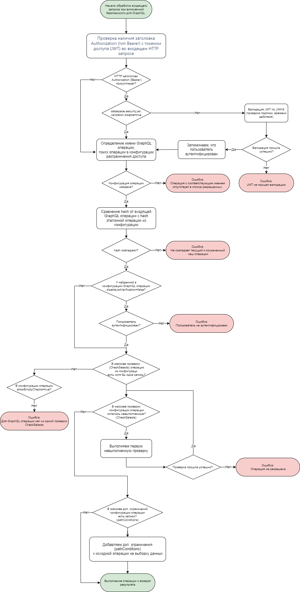

## Разграничение доступа к GraphQL-операциям и данным

Компонент Platform V DataSpace Community Edition предоставляет функциональность разграничения доступа к GraphQL-операциям и данным.

Разграничение доступа к данным осуществляется при помощи следующих возможностей:

1. Каждая операция должна иметь уникальное имя, исполнение безымянных GraphQL операций запрещено.
2. Проверка доступа путем выполнения проверочных запросов (далее — `CheckSelects`) перед выполнением GraphQL-операции.
   Операция будет выполнена, только если все указанные для нее проверочные запросы вернут непустой результат.
   Проверочный запрос можно использовать, например, для проверки прав и значений переменных перед операциями mutation.
3. Ограничение доступа к определенным данным путем наложения дополнительных условий фильтрации по пути к полю (далее — `PathConditions`). Дополнительное условие фильтрации связывается с полем, к которому применима фильтрация (имеет аргумент `cond`), и накладывает дополнительные ограничения в выборке.
   Дополнительные условия фильтрации через путь к полю позволяют ограничить выбираемые данные вне зависимости от пользовательского (переданного в переменной или заданного явно) условия фильтрации при его наличии.

Для того чтобы воспользоваться функциональностью разграничения доступа, необходимо:

1. Сформировать список разрешенных к исполнению GraphQL-операций с CheckSelects и PathConditions (далее — конфигурация разграничения доступа).
   Структура элементов списка описана ниже.
2. Передать подготовленную на предыдущем шаге конфигурацию разграничения доступа в Platform V DataSpace Community Edition (на этапе разработки — через специализированный API, на этапе сборки дистрибутива — через файл).

Способ передачи конфигурации определяется настройкой `dataspace.security.graphql.permissions.source`, принимающей одно из следующих значений:

* `db`— в Platform V DataSpace Community Edition поднимается endpoint `/models/${modelId}/security/permissions` для управления конфигурацией (API приведено ниже).
* `file` — конфигурация разграничения доступа загружается из файла конфигурации.

Структура конфигурации разграничения доступа не зависит от значения настройки `dataspace.security.graphql.permissions.source`.
Перечень разрешенных GraphQL-операций описывается в формате JSON.

> **Примечание**
>
> Режим `dataspace.security.graphql.permissions.source=db` предназначен для разработки и не рекомендован к использованию в промышленной эксплуатации.

> **Примечание**
>
> На запросы интроспекции по умолчанию не накладываются никакие проверки даже со включенной безопасностью.
> Имеется возможность указать единственную проверку, работающую аналогично CheckSelect (будут рассмотрены далее) и выполняемую перед запросами интроспекции. Для этого необходимо указать в качестве значения настройки `dataspace.security.graphql.introspection.query.check-condition` строковое выражение желаемой проверки.
> Данная проверка будет выполняться только на запросах интроспекции, т.е. запросах, содержащих исключительно поля получения сведений о структуре схемы GraphQL (`__schema`, `__type`).

### Конфигурация разграничения доступа

Конфигурация разграничения доступа состоит из описания разрешенных к выполнению GraphQL-операций с `CheckSelects` и `PathConditions`.

Пример описания разрешенной GraphQL-операции с проверкой `CheckSelects`:

```json
[
  {
    "name": "createProduct",
    "body": "mutation createProduct($someCode: String, $level: Int) {  packet {    createProduct(input: {id:\"prod1\", code: $someCode, level: $level}) {      id    }  }}",
    "allowEmptyChecks": false,
    "disableJwtVerification": false,
    "checkSelects": [
      {
        "typeName": "SubjectPrivileges",
        "conditionValue": "${Integer:level} < 10 && it.personnelNumber==${jwt:employeeID} && it.privilege=='createProduct'",
        "description": "Only a user with the appropriate permission can make this request."
      }
    ]
  }
]
```

Пример описания разрешенной GraphQL-операции с ограничением `PathConditions`:

```json
  [
    {
      "name": "searchProduct",
      "body": "query searchProduct($sort: [_SortCriterionSpecification!], $limit: Int, $offset: Int, $searchCond: String) {   searchProduct(cond: $searchCond, limit: $limit, offset: $offset, sort: $sort) {    count    elems {      code    }  }}",
      "allowEmptyChecks": true,
      "disableJwtVerification": false,
      "checkSelects": [],
      "pathConditions": [
        {
          "path": "searchProduct",
          "cond": "it.level < 10 && entities{type=SubjectPrivileges, cond=it.personnelnumber==${jwt:employeeID} && it.privilege=='searchProduct'}.$exists"
        }
      ]
    }
  ]
```

Элементы описания разрешенной GraphQL-операций:

* `name` — имя операции GraphQL (название, которое идет после `query` или `mutation`, обязательный атрибут);
* `body` — текст GraphQL-операции (используется для сверки без учета пробельных символов и переносов строк, обязательный атрибут);
* `allowEmptyChecks` — тип boolean — указывает явно, что для данной операции ограничения (`CheckSelects`) могут быть не заданы, в противном случае не позволяет выполнить операцию, пока не будут указаны проверочные условия `CheckSelects`. Если коллекция `CheckSelect` пустая, то данный атрибут должен быть выставлен в "true";
* `disableJwtVerification` — признак разрешения анонимного доступа (не требующего аутентификации и авторизации пользователя);
* `checkSelects` — коллекция проверок, которые выполняются перед выполнением операции (необязательный атрибут);
  * `typeName` — базовый тип, на котором строится запрос к БД. Если поле отсутствует, то в качестве базового типа используется предопределенный системный тип `SysRootSecurity` (необязательный атрибут);
  * `conditionValue` — ограничивающее выборку условие (обязательный атрибут);
  * `description` — описание ограничения (необязательный атрибут);
* `pathConditions` — дополнительно накладываемые условия фильтрации по указанным путям в запросе (необязательный атрибут):
  * `path` — путь в GraphQL-запросе без имени операции, разделитель "." (обязательный атрибут);
  * `cond` — условие, накладываемое по указанному пути (обязательный атрибут).

> **Примечание**
>
> Дополнительные условия  `PathConditions` и `CheckSelects` применимы как к `query`-операциям, так и к `mutation`-операциям.
> Но выборку данных в `mutation`-операциях необходимо использовать с осторожностью. Ограничение выбираемых данных в `mutation`-операциях рекомендуется осуществлять только за счет фиксирования структуры операции.
>
> Каждая проверка `CheckSelects` приводит к дополнительному обращению к БД. Для `query`-операций вместо проверок `CheckSelects` рекомендуется рассмотреть использование дополнительных условий `PathConditions`, применяемых при выполнении переданной операции, если это отвечает требованиям безопасности. В большинстве случаев `CheckSelects` может быть преобразован к `PathConditions`.
>
> Провал проверки `CheckSelects` приводит к возврату сообщения об ошибке. Дополнительное ограничение `PathConditions` не приводит к возвращению ошибки, но влияет на объем выбираемых данных (вплоть до пустого результата).

Путь в `PathConditions` является полным путем от корня запроса (не включая имя запроса) до требуемого поля, также используются псевдонимы для поля при наличии.
Если в запросе используется запрос со слиянием через `merge`-поле, то в качестве узла в пути используется имя соответствующего интерфейса, указанного во встроенном фрагменте.
Пример запроса и путей `PathConditions`:

```graphql
query pathConditionsExampleQuery {
  searchProduct {
    elems {
      id
      servicesAlias: services(cond: "it.code == 'goodCode'") {
        elems {
          id
          name
        }
      }
    }
  }
  merge {
    elems {
      ... on Product @mergeReqSpec(cond: "it.code $like 'product%'") {
        code
        services {
          elems {
            id
            name
          }
        }
      }
      ... on Document {
        name
      }
    }
  }
}
```

В примере выше пути:
- `searchProduct` — путь к выбираемым продуктам;
- `searchProduct.elems.servicesAlias` — путь к выбираемым услугам у выбранных продуктов (используется псевдоним для поля `services`);
- `merge.elems.Product` — путь к выбираемым продуктам в запросе слияния `merge`;
- `merge.elems.Product.services` — путь к выбираемым услугам у выбранных продуктов в запросе слияния `merge`;
- `merge.elems.Document` — путь к выбираемым документам в запросе слияния `merge`.

### Получение конфигурации разграничения доступа из файла

Получение конфигурации разграничения доступа из файла включается настройкой `dataspace.security.graphql.permissions.source=file`.

Конфигурация разграничения доступа загружается из файла по пути *graphql-permissions.json*.
Для того чтобы файл использовался Platform V DataSpace Community Edition, необходимо разместить файл *graphql-permissions.json* в директории с моделью рядом с файлом *model.xml* в проекте сборки,
тогда плагин генерации модели при сборке поместит файл в результирующую директорию, которая будет использоваться Platform V DataSpace Community Edition.

Пример содержимого файла:

```json
[
  {
    "name": "searchProduct",
    "body": "query searchProduct($sort: [_SortCriterionSpecification!], $limit: Int, $offset: Int, $searchCond: String) {   searchProduct(cond: $searchCond, limit: $limit, offset: $offset, sort: $sort) {    count    elems {      code    services { elems {    code    }}   }  }}",
    "pathConditions": [
      {
        "path": "searchProduct.elems.services",
        "cond": "it.code $like '%target'"
      }
    ],
    "checkSelects": [],
    "allowEmptyChecks": true
  },
  {
    "name": "createProduct",
    "body": "mutation createProduct($someCode: String, $level: Int) {  packet {    createProduct(input: {id:\"prod1\", code: $someCode, level: $level}) {      id    }  }}",
    "checkSelects": [
      {
        "typeName": "SubjectPrivileges",
        "conditionValue": "${Integer:level} < 10 && it.personnelNumber==${jwt:employeeID} && it.privilege=='createProduct'",
        "description": "Only a user with the appropriate permission can make this request."
      }
    ]
  }
]
```

### Получение конфигурации разграничения доступа из БД и ее загрузка через REST

Включение загрузки разрешенных GraphQL-операций в БД через REST осуществляется настройкой `dataspace.security.graphql.permissions.source=db`,
которая поднимает необходимые REST-контроллеры и устанавливает источником конфигурации БД.

Управление конфигурацией разграничения доступа в БД осуществляется через следующий REST API:

| HTTP-метод  | Путь                                                               | Параметры                                                                                             | Описание                                                                                                           |
|-------------|--------------------------------------------------------------------|-------------------------------------------------------------------------------------------------------|--------------------------------------------------------------------------------------------------------------------|
| POST        | /models/${modelId}/security/permissions/operations-bulk/replaceAll | В теле запроса передается JSON-конфигурация разграничения доступа                                     | Удаление всех текущих разрешенных GraphQL-операций с последующим созданием новых операций                          |
| POST        | /models/${modelId}/security/permissions/operations-bulk/replace    | В теле запроса передается JSON-конфигурация разграничения доступа                                     | Добавление новых разрешенных GraphQL-операций с заменой при пересечении по имени                                   |
| POST        | /models/${modelId}/security/permissions/operations-bulk/deleteAll  | —                                                                                                     | Удаление из БД всех разрешенных GraphQL-операций                                                                   |
| POST        | /models/${modelId}/security/permissions/operations-bulk/merge      | В теле запроса JSON [{name : String, body : String}]                                                  | Создание в БД тел новых разрешенных GraphQL-операций по имени или обновление тел существующих операций             |
| POST        | /models/${modelId}/security/permissions/operations-bulk/create     | В теле запроса передается JSON-разграничения доступа                                                  | Добавление в БД коллекции новых разрешенных GraphQL-операций. В случае конфликта по имени выбрасывается исключение |
| POST        | /models/${modelId}/security/permissions/operations                 | В теле запроса передается JSON одной операции из конфигурации разграничения доступа                   | Добавление в БД одной новой разрешенной GraphQL-операции. В случае конфликта по имени выбрасывается исключение     |
| GET         | /models/${modelId}/security/permissions/operations                 | name : String — шаблон имен операций (используется поиск по like), page: Integer, pageSize: Integer   | Получение списка разрешенных GraphQL-операций                                                                      |
| PUT         | /models/${modelId}/security/permissions/operations/{operationName} | operationName : String — имя замещаемой операции, тело — конфигурация замещаемой операции (без имени) | Замещение разрешенной GraphQL-операции по имени                                                                    |
| DELETE      | /models/${modelId}/security/permissions/operations/{operationName} | operationName : String — имя удаляемой операции                                                       | Удаление разрешенной GraphQL-операции по имени                                                                     |

Все полученные для сохранения конфигурации разграничения доступа проходят следующую валидацию:
- Корректность тела GraphQL-запроса.
- `CheckSelects` — корректность условия.
- `PathConditions` — корректность условия.
- Отсутствие `PathConditions` с одинаковым путем.
- Отсутствие `PathConditions` с некорректным путем.
- Отсутствие неиспользуемых `PathConditions`.
- Отсутствие `PathConditions` на поля, к которым неприменима фильтрация, т.е. не имеющие аргумента `cond` (для `merge`-запросов фильтрация всегда применима за счет наличия директивы `@mergeReqSpec`).

#### Ограничения на длины полей конфигурации при размещении в БД

Когда конфигурация разграничения доступа размещается в БД (`dataspace.security.graphql.permissions.source=db`) действуют следующие ограничения на длины полей:

* `name` — 254 символа;
* `body` — не ограничен;
* `checkSelects.typeName` — 254 символа;
* `checkSelects.conditionValue` — не ограничен;
* `checkSelects.description` — 254 символа;
* `pathConditions.path` — не ограничен;
* `pathConditions.cond` — не ограничен.

### Передача и верификация JWT при обращении к модели с разграничением доступа

При вызове GraphQL-операции передача JWT (JSON Web Token) осуществляется в HTTP-заголовке `Authorization` (тип `Bearer`).

Данные, передаваемые в JWT, могут быть использованы в `CheckSelects` (поле `conditionValue`) и `PathConditions` (поле `cond`).

Передача JWT при обращении к Platform V DataSpace Community Edition не является обязательной. Необходимость наличия JWT для
конкретной GraphQL-операции определяется значением атрибута `disableJwtVerification` конфигурации разграничения доступа:

* Если значение — `disableJwtVerification=true`, то GraphQL-операция может быть выполнена без наличия JWT в HTTP-запросе.
  При этом ограничивающие и проверочные условия либо должны отсутствовать, либо в них не должно быть подстановок значений из JWT.
  В противном случае возникнет ошибка в runtime.
* Если значение — `disableJwtVerification=false`, то GraphQL операция не может быть выполнена без наличия JWT в HTTP-запросе
  вне зависимости от наличия или отсутствия ограничивающих и проверочных условий.

Для валидации JWT необходимо указать способ получения JWKS (JSON Web Key Set). Для этого необходимо задать значение настройки `dataspace.security.jwks.source`. Допустимые значения: `file`.

При использовании источника `dataspace.security.jwks.source=file`, необходимо разместить файл *jwks.json* рядом с файлом *model.xml* в проекте сборки Platform V DataSpace Community Edition,
тогда плагин генерации модели при сборке поместит файл в результирующую директорию, которая будет использоваться Platform V DataSpace Community Edition.

По умолчанию модель не будет поднята, если указан `dataspace.security.graphql.permissions.source`, но не указан `dataspace.security.jwks.source`.
Для явного отключения необходимости верификации JWT (например, при проведении локальных тестов) необходимо установить значение настройки `dataspace.security.jwt.validation.disable=true`.
При данном значении настройки отключается любая верификация JWT по JWKS (в том числе, когда JWKS задан).
Все JWT признаются валидными.

> **Внимание!**
>
> На промышленных и тестовых стендах не рекомендуется выставлять значение `dataspace.security.jwt.validation.disable=true`.

При верификации JWT проверяются поля `exp` (время истечения срока действия) и `nbf` (время, до которого JWT не должен обрабатываться).

В случае рассинхронизации времени между разными модулями, использующими один и тот же JWT, можно воспользоваться следующими настройками:
* `dataspace.security.jwt.expDelta` — задает количество секунд, в течение которых JWT еще считается действующим после истечения времени `exp`.
* `dataspace.security.jwt.nbfDelta` — задает количество секунд, в течение которых JWT уже считается действующим до наступления времени `nbf`.

Вышеуказанные настройки позволяют снизить вероятность наступления ситуации, когда один модуль считает токен еще действующим, а другой уже просроченным.

### Использование подстановки переменных в ограничивающих строковых условиях

#### Подстановка значений из JWT

Проверки и ограничения разрешенных GraphQL-операций используют строковые выражения Platform V DataSpace Community Edition (поле `conditionValue` в `CheckSelects` и поле `cond` в `PathCondition`).
В указанных строковых выражениях могут использоваться подстановки значений `claim` из JWT, переданного в заголовке `Authorization` запроса, подстановки значений других заголовков и переданных переменных GraphQL операции.

> **Примечание**
>
> Подстановки значений `claim` из JWT работают только в строковых выражения `CheckSelects` (поле `conditionValue`) и `PathConditions` (поле `cond`).
> В строковых выражениях внутри GraphQL-операции подстановка значений из JWT не производится.
>
> Подставлять можно только примитивные значения и массивы примитивных значений.

Подстановка значения из JWT в общем случае имеет следующий вид: `${String[]:jwt:userdata.roles}`, где:

* `String[]` — тип значения из JWT, `[]` указывает на то, что значение является массовом примитивов, а не одиночным примитивом;
* `jwt` — указывает на получение значения переменной из JWT;
* `userdata.roles` — путь относительно полезной нагрузки JWT. Результатом пути может быть только примитивный элемент или коллекция примитивных элементов. В пути не допускаются промежуточные коллекционные объекты.

Пример строкового выражения с подстановкой значения из JWT: `"'adminRole' $in ${String[]:jwt:userdata.roles}"`.
Если значение переменной String, то тип может быть опущен: `"'adminRole'==${jwt:userdata.mainRole}"`. Это аналогично `"'adminRole'==${String:jwt:userdata.mainRole}"`. Тип `String[]` может быть сокращен до `[]`.

#### Подстановка значения из переменных GraphQL-запроса

Пример строкового выражения с подстановкой значения из GraphQL-переменной: `"${String:productCode} $like '%somePostfix'"`.
Тип String может быть также опущен, как и при подстановке из JWT.

В некоторых операциях есть возможность передать в GraphQl-переменной массив объектов. Этот массив тоже можно использовать в строковых условиях. В этом случае строковое выражение с подстановкой массива из N объектов превращается в N условий с подстановкой примитивов, результаты проверки которых объединяются через логическую операцию `И`.
При подстановке переменной-массива следует учесть:

* в одном строковом выражении можно использовать не более одного массива объектов;
* при этом один и тот же массив объектов можно использовать несколько раз;
* результатом вычисления пути должен быть примитив.

Например, если для запроса содержащего массив `input` объектов задать строковое выражение `${input.code}==${input.name}`, это приведет к тому, что для каждого элемента в массиве `input` будет проверяться условие на равенство полей code и name

### Алгоритм разграничения доступа к данным

Алгоритм разграничения доступа к данным осуществляется следующим образом:

1. Проверяется наличие заголовка `Authorization` (тип `Bearer`) с токеном доступа (JWT) во входящем запросе.
  * Если `dataspace.security.jwt.validation.disable=true`, то JWT не проверяется.
  * Если заголовок с JWT обнаружен и `dataspace.security.jwt.validation.disable=false`, то выполняется валидация JWT при помощи JWKS. Проверяется подпись JWT и время действия токена.
2. Определяется имя GraphQL-операции.
3. В конфигурации разграничения доступа ищется запись по имени операции. Если запись не найдена, то возвращается информация об отсутствии операции в перечне разрешенных к исполнению. В противном случае выбирается найденная запись.
4. Проверяется совпадение hash переданной операции с hash эталонной операции (из найденной записи конфигурации). Если значения hash не совпадают, то возвращается соответствующая ошибка.
5. Выполняются `CheckSelect`. Если все `CheckSelect` вернули непустой результат, то выполнение операции продолжается. В противном случае возвращается ошибка с информацией о том, что операция не прошла проверку безопасности.
6. Проверяется наличие условий `PathCondition`.
   При их наличии определяется место их применения по явно указанному пути `path`.
   При выполнении операции дополнительно накладываются условия `PathCondition` вне зависимости от того, чем является `cond` по данному пути: явно заданным условием, переменной или вообще отсутствует. Условия добавляются с использованием оператора `&&` следующим образом: `(userCond) && (additional cond)`.

Блок-схема алгоритма:



### Настройки функциональности разграничения доступа к GraphQL-операциям и данным

| Настройка                                       | Допустимые значения                                               | Описание                                                                                                                                                                                                                                                                                                                                                                                                                         |
|-------------------------------------------------|-------------------------------------------------------------------|----------------------------------------------------------------------------------------------------------------------------------------------------------------------------------------------------------------------------------------------------------------------------------------------------------------------------------------------------------------------------------------------------------------------------------|
| `dataspace.security.graphql.permissions.source` | file, db                                                          | Указывает источник, из которого берется конфигурация разграничения доступа                                                                                                                                                                                                                                                                                                                                                       |
| `dataspace.security.jwks.source`                | file                                                              | Указывает источник JWKS                                                                                                                                                                                                                                                                                                                                                                                                          |
| `dataspace.security.jwt.validation.disable`     | true или false (по умолчанию — false)                             | Определяет отключение валидации JWT. При значении "true" никакой проверки JWT не осуществляется, JWT автоматически признается валидным                                                                                                                                                                                                                                                                                           |
