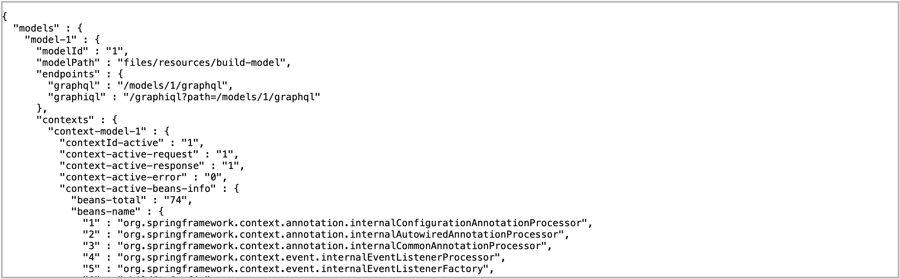

# Демонстрационное приложение DataSpace Community Edition "Трекер задач"

## Введение

<p>Приложение "Трекер задач" позволяет вести списки задач в многопользовательском режиме, при этом каждый пользователь может предоставить другому пользователю права доступа к своим задачам с различным уровнем доступа (только на чтение, чтение и запись). У каждой задачи есть различные параметры (срок, статус, приоритет и др.), а также возможность гибкой фильтрации задач по этим параметрам.</p>

<p>Приложение позволяет быстро начать работу с DataSpace, познакомиться со всеми основными аспектами разработки решений на данной платформе, такими как развертывание инфраструктуры приложения, настройка интеграции frontend и backend, механизмы обеспечения безопасности и разграничения прав доступа, сборка проекта и его запуск.</p>

C технической точки зрения проект представляет собой **fullstack-приложение**, backend-часть которого реализована на **DataSpace Community Edition**, а frontend на  **React**. В качестве системы аутентификации и авторизации используется  **Keycloak**.<br>

#### Принципиальная схема приложения "Трекер задач"

<br>

**Пользователь системы** (User):
- Проходит аутентификацию/авторизацию в Keycloak (получение JSON Web Token, JWT)
- Осуществляет работу в приложении в соответствии с политиками доступа и разрешениями (permissions)

**Администратор системы доступа** (IAM Admin, Identity and Access Manager):
- определяет ролевую модель
- управляет пользователями (создание, выдача прав)

## Технические особенности

В проекте используется **автоматическая кодогенерация** для создания TypeScript-типов, GraphQL-запросов и разрешений. Это позволяет обеспечить типобезопасность, согласованность кода и повысить производительность разработки. Подробное описание процессов кодогенерации, их настройки и преимуществ можно найти в [документации по автоматической кодогенерации](./docs/codegen_permgen/).

## Необходимые компоненты

Помимо компонентов необходимых для запуска DataSpace:
- **Git**
- **Open JDK** версии 17 и выше
- **Docker и Docker Compose** версии 2.29 и выше

для запуска данного приложения необходимо дополнительно установить **NodeJS** для сборки и запуска frontend-части проекта.

Официальные сайты:
- Git: https://git-scm.com/
- OpenJDK https://jdk.java.net/archive/
- Docker: https://www.docker.com/
- Node.js https://nodejs.org/en


## Установка и запуск приложения "Трекер задач"

### 1. Скачивание DataSpace Community Edition

Если репозиторий DataSpace Community Edition уже был ранее скачан более скачивать что-то нет необходимости. В противном случае необходимо выбрать удобное место на диске, открыть в нем терминал и выполнить команду:

```bash
git clone https://gitverse.ru/sbertech/dataspace-ce.git
```
В результате на вашем компьютере будет клонирован репозиторий DataSpace Community Edition.


### 2. Запуск DataSpace Community Edition

- Откройте терминал в папке
**dataspace-ce/examples/todolist**, выполните команду:

```bash
./todolist.sh
```
Запустится скрипт сборки и запуска DataSpace. В ходе его исполнения будет проверен файл **.env** папки **docker** на предмет настроек подключения DataSpace к серверу баз данных Postgres, все необходимые настройки модели, прав доступа к данным а также конфигурация Postgres будут скопированы в файл **context-child.properties** папки **dataspace-ce/examples/files**, скрипт выполнит сборку и запуск компонентов приложения в Docker-контейнерах. По завершению будет выведена диагностическая информация о конфигурации Postgres, а также дополнительные полезные ссылки.


После успешного запуска DataSpace можно увидеть список загруженных моделей по адресу:<br>
http://localhost:8081/actuator/models



Также появляется возможность создавать и выполнять GraphQL-запросы к модели данных DataSpace в удобном Web-редакторе:<br>
http://localhost:8081/graphiql?path=/models/1/graphql


#### KeyCloak

Также, помимо DataSpace, в процессе работы скрипта ```todolist.sh``` происходит запуск и настройка **системы аутентификации и авторизации Keycloak**:
- в Docker-контейнере запускается **локальный сервер Keycloak**
- создается **учетная запись администратора** (login:admin, password:12345)
- импортируются **демо-данные**, необходимые для начала работы с приложением "Трекер задач" (пользователи user1,user2, пароли: 12345)
- подготавливается **JWKS** для React-приложения

После запуска проекта административная консоль Keycloak доступна по адресу: http://localhost:8180/ (admin, 12345)

Создание и настройка всех необходимых элементов Keycloak в данном проекте происходит автоматически, при желании более детально познакомиться с Keycloak в [дополнительном разделе документации](./docs/keycloak/).


### 3. Запуск Frontend-приложения (React)

Финальным этапом запуска проекта "Список задач" будет сборка и запуск React-приложения. Более детальную информацию по frontend-части, структуру и назначение файлов можно найти в [дополнительном разделе документации](./docs/react/)

- Запустите терминал в папке **dataspace-ce/examples/todolist** и выполните команду для скачивания всех необходимых NPM-пакетов приложения:
```bash
npm install
```
- Далее выполните сборку и запуск приложения:
```bash
npm start
```

В результате произойдет автоматический запуск приложения "Список задач" по адресу http://localhost:3000


**Поздравляем!**

## Работа с приложением

Дальнейшие шаги по практической работе с приложением "Список задач" описаны в [дополнительном разделе документации](./docs/userflow/)


## Завершение работы приложения

Для остановки KeyCloak и React-приложения в терминалах с запущенным процессами нажмите **Ctrl + C**

Остановку Docker-контейнеров можно выполнить либо в графическом интерфейсе Docker, либо выполнив в папке **docker** следующую команду:
```bash
docker-compose down -v
```

## Благодарим за внимание! Успехов!

