# Ручное создание демо-данных IAM KeyCloak

В процессе запуска приложения "Трекер задач" с помощью скрипта ```todolist.sh``` предполагается автоматическое создание всех необходимых данных в Keycloak. В случае желания более детально познакомиться с созданием объектов Keycloak в данном документе можно познакомиться с ручным созданием и редактирование всех необходимых объектов и настроек.

1. Запустите скрипт ```./todolist.sh``` 
2. Авторизуйтесь в консоли администратора http://localhost:8180/ с реквизитами admin 12345<br>
Учетная запись администратора admin создается скриптом todolist.sh автоматически при запуске Docker-контейнера с Keycloak

3. Создайте новый realm с именем **todos**:

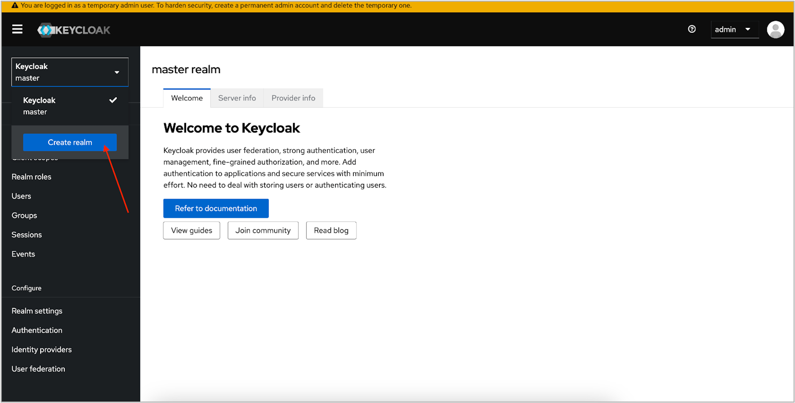
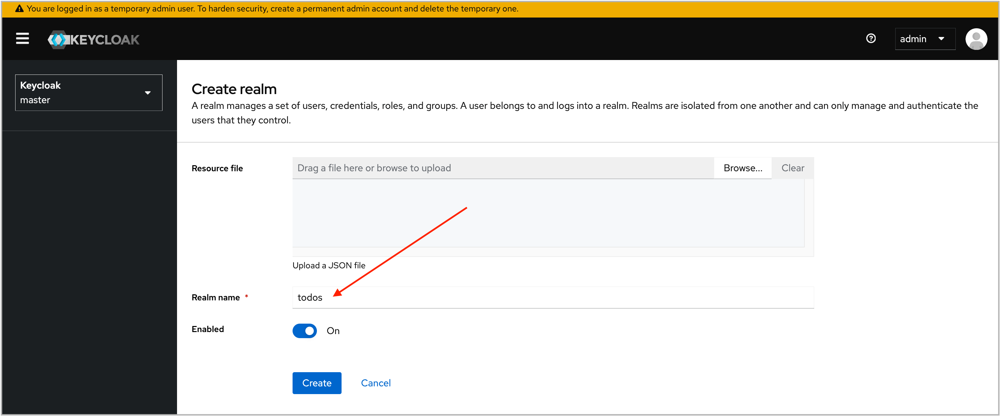


4. Создайте нового клиента (client):<br>
ID: **todos**<br>
Root URL: **http://localhost:3000**

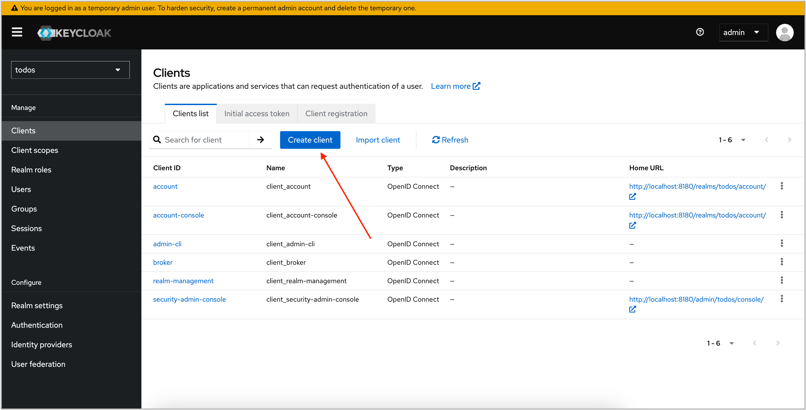
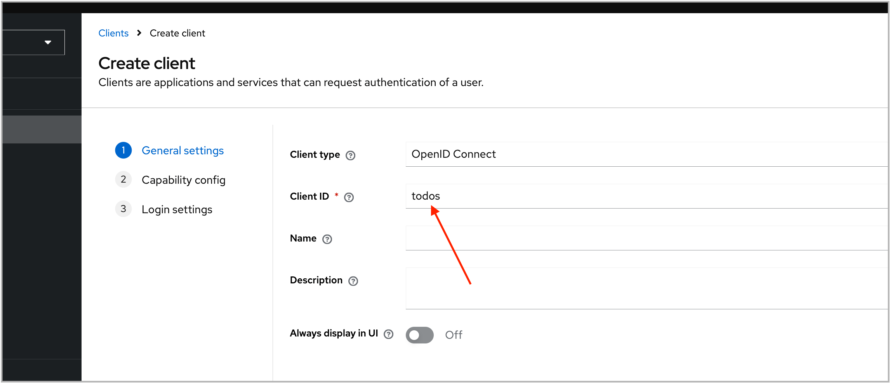
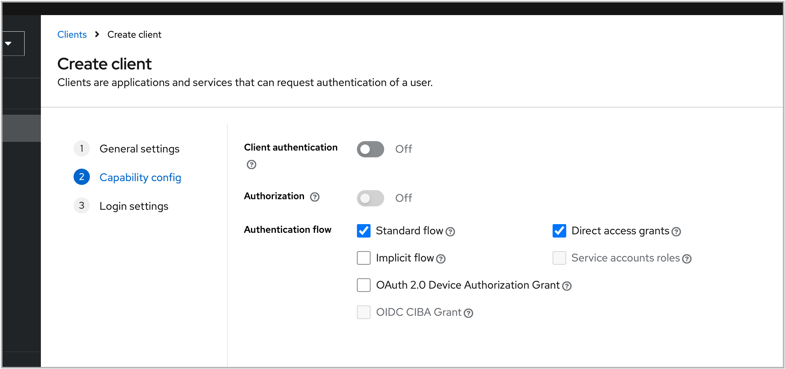
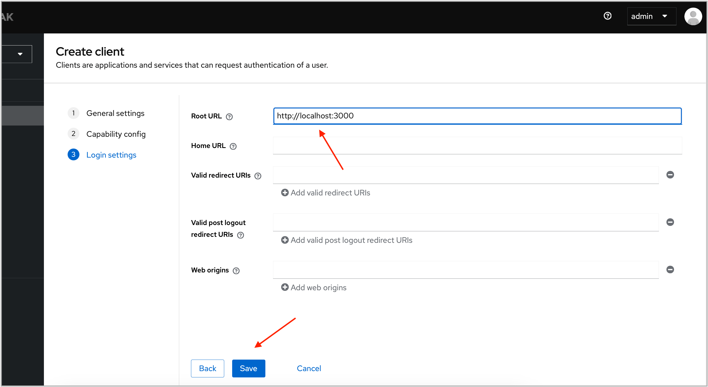


5. Создайте двух демо-пользователей:
    - user1  user1@mail.ru
    - user2  user2@mail.ru<br>
для обоих пользователей создайте пароли, например 12345, указав что они не временные

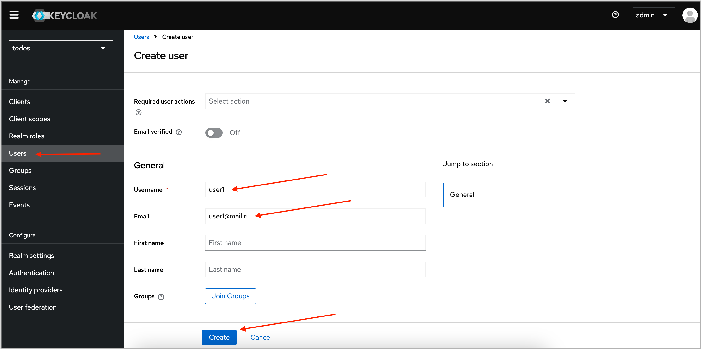
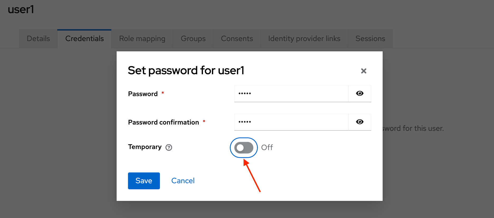
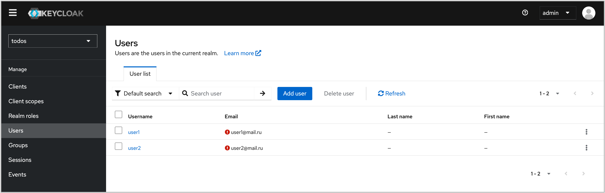

6. Создайте роль для Realm: **user**

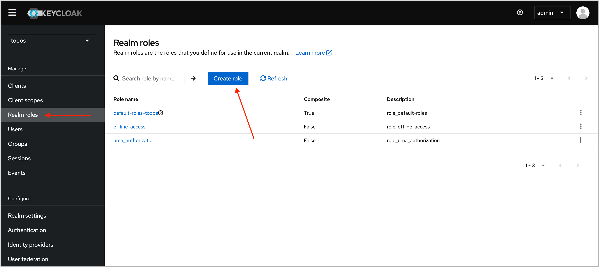
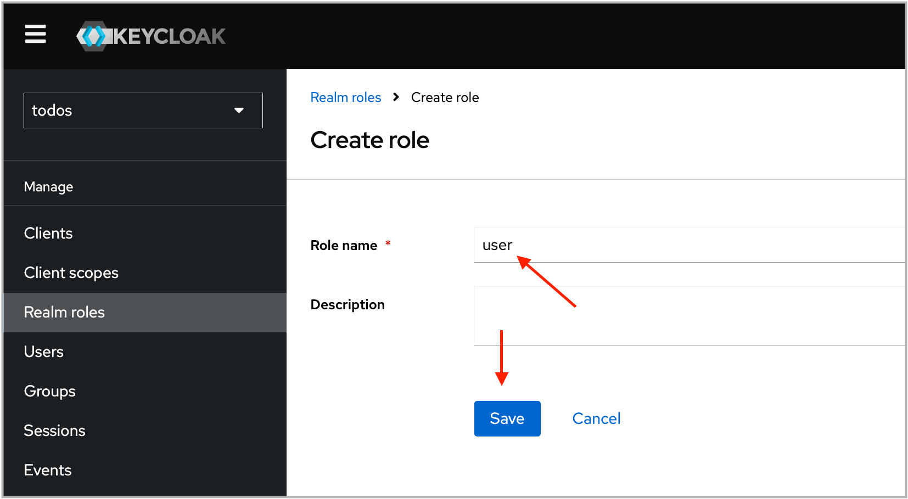

7. Добавьте роль **user** для обоих пользователей **user1** и **user2**:

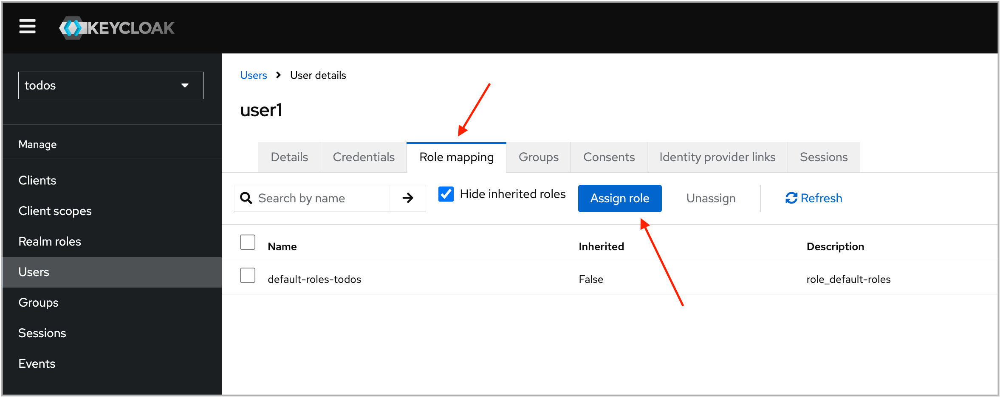
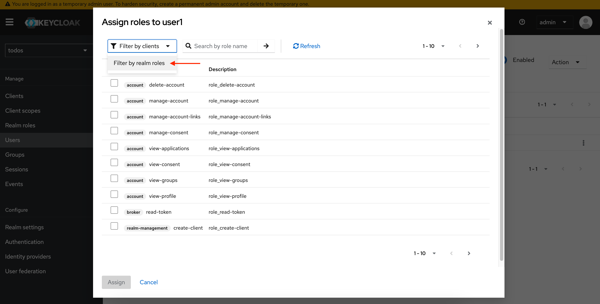
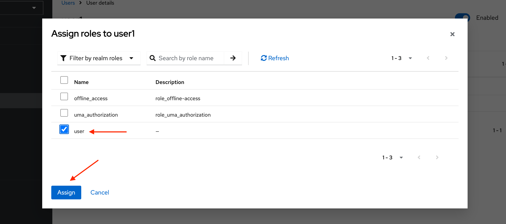

8. Создание демо-данных для проекта "Трекер задач" завершено. Запустите frontend-часть приложения, выполнив в папке **dataspace-ce/examples/todolist** команду:
```bash
npm start
```