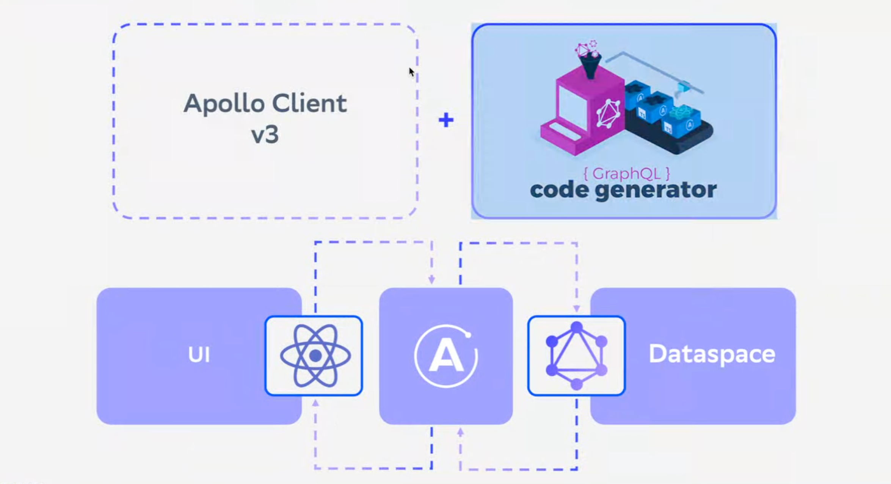

# Frontend-часть проекта

Frontend-часть проекта представляет собой **React-приложение**, в качестве сборщика используется **Webpack**, библиотека визуальных компонентов - **Antd**, для удобного доступа к данным и работы с GraphQL-запросами применяется **Apollo Client**, для генерации TypeScript-типов - **GraphQl code generator.**  Проект написан на **TypeScript** и для знакомства с ним необходимо хотя бы базовое знание JavaScript.



## Структура проекта

| Директория/файл            | Описание                                                      |
|----------------------------| ------------------------------------------------------------- |
| docs/                      | файлы документации данного приложения                         |
| files/                     | конфигурационные файлы модели и доступа к данным              |
| - context-child.properties | конфигурационный файл подключения базы данных                 |
| - graphql-permissions.json | файл разрешенных запросов к DataSpace                         |
| - jwks.json                | JWKS-ключ для выполнения запросов                             |
| - model.xml                | модель данных предметной области DataSpace                    |
| - todos-realm.json         | файл импорта демо-данных KeyCloak                             |
| graphql/                   | GraphQL-компоненты проекта                                    |
| - requests.graphql         | GraphQL-запросы приложения                                    |
| - schema.graphql           | GraphQL-схема модели данных                                   |
| public/                    | статическая директория React-приложения                       |
| - index.html               | статическая стартовая страница React-приложения               |
| - keycloak.json            | конфигурационный файл подключения к IAM KeyCloak              |
| src/                       | TypeScript-компоненты приложения                              |
| .env                       | конфигурационный файл настройки GraphQL endpoint DataSpace    |
| package.json               | конфигурационный файл NPM (Node Package Manager)              |
| README.MD                  | файл документации, текущее руководство                        |
| todolist.sh                | скрипт запуска данного проекта                                |
| tsconfig.json              | конфигурационный файл TypeScript                              |
| webpack.config.js          | основной конфигурационный файл сборщика Webpack               |
| webpack.dev.config.js      | конфигурационный файл Webpack для режима разработки           |


Кроме этих файлов после выполнения команды ```npm install``` в проекте будет создана папка **node_modules**, содержащая в себе все скачанные модули в соответствии с зависимостями из файла package.json


## Полезные ссылки:

https://react.dev/

https://webpack.js.org/

https://www.apollographql.com/

https://ant.design/
