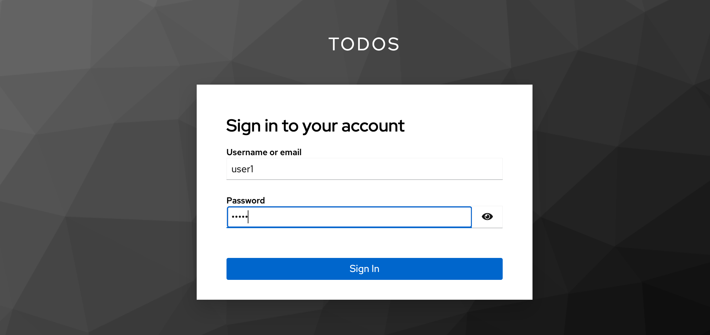
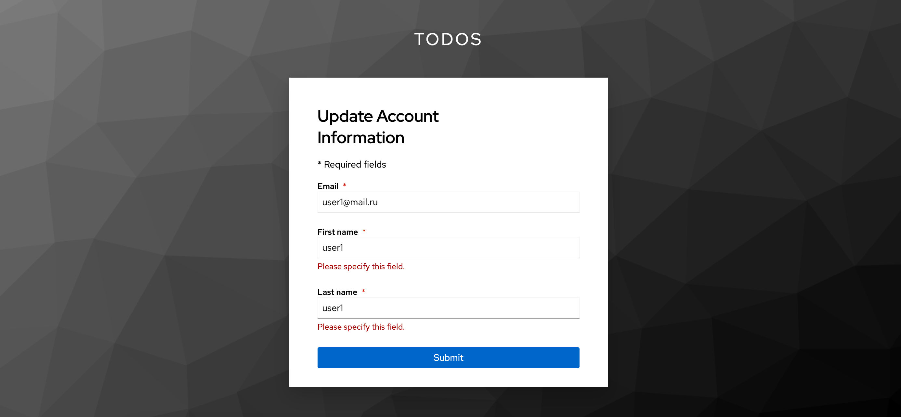
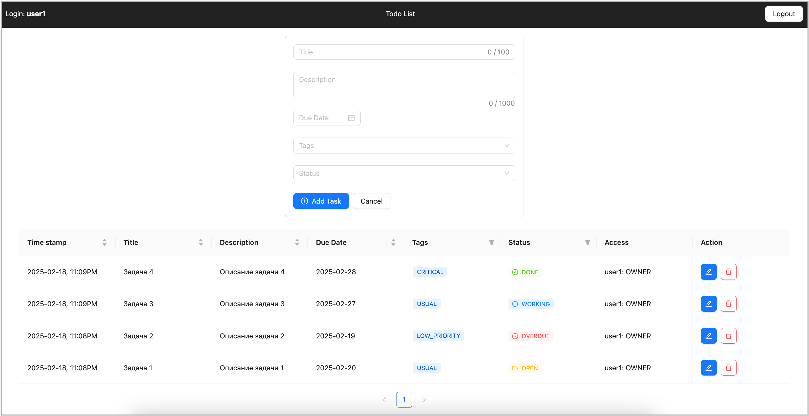
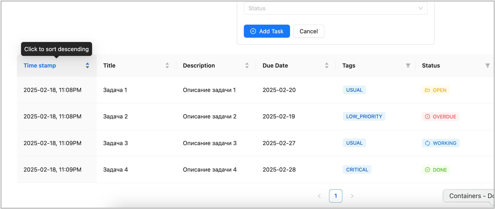
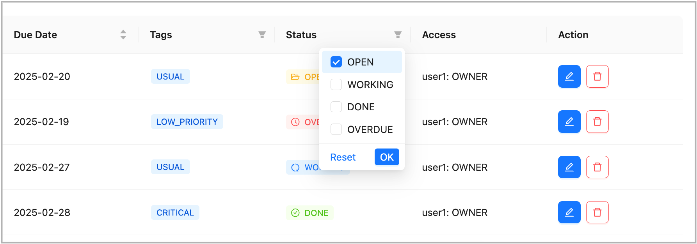
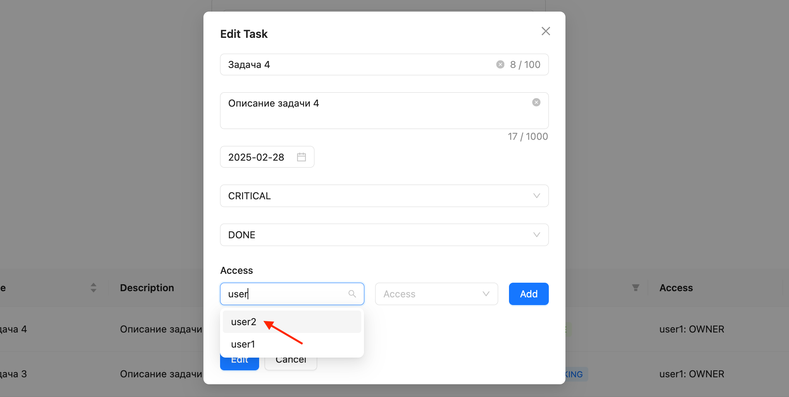
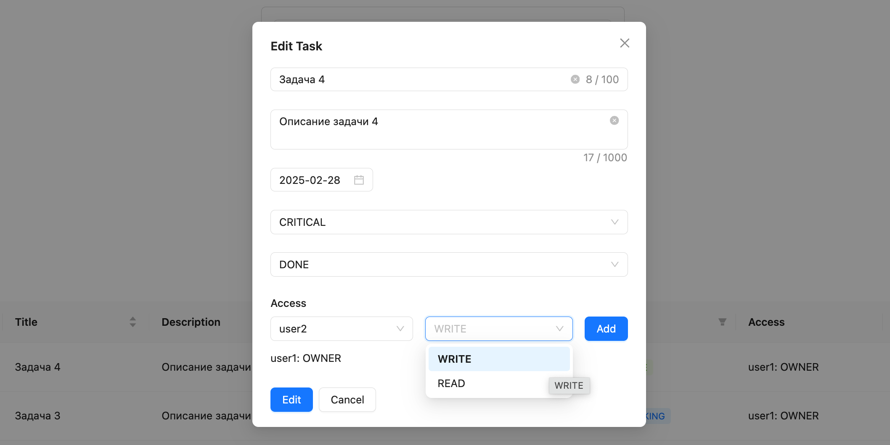
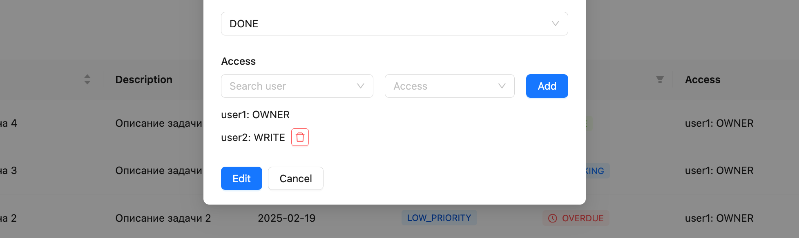
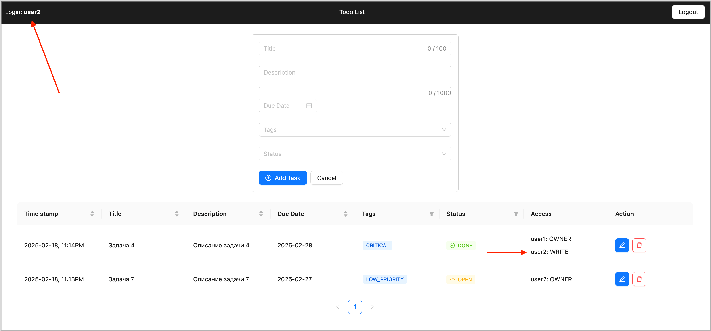

# Работа с приложением "Список задач"

Данный раздел описываем вариант начала работы с приложением и демонстрацию основных возможностей приложения.

1. После запуска приложения командой ```npm start``` авторизуйтесь с именем пользователя ```user1``` и паролем ```12345```



2. Система предложит указать имя и фамилию пользователя, введите любые данные:



3. Добро пожаловать в приложение! <br>На схеме ниже представлены основные элементы интерфейса


Создать новую задачу, указав ее название, краткое описание, срок, приоритет и статус можно в форме добавления новой задачи. После создания задачи она отобразится в списке задач текущего пользователя. После создания нескольких задач интерфейс приложения будет выглядеть так:



Список задач текущего пользователя обладает возможностями сортировки и фильтрации задач по различным критериям:




4. Для демонстрации возможности работы в приложении нескольких пользователей и разграничения прав доступа к задачам, выйдем из текущего пользователя ```user1```, авторизуемся под пользователем ```user2```, и вновь вернемся в ```user1```. Данные действия необходимы для создания в базе данных DataSpace информации о пользователе user2 и для последующего добавления ему разрешения на доступ к задаче пользователя ```user1```. Здесь важно понимать что на момент старта приложения оба пользователя (user1 и user2) уже были в IAM KeyCloak (в результате импорта из файла todos-realm.json), но информации о них не было в DataSpace. Данные в DataSpace появляются только после авторизации пользователя в приложении.

5. Добавим для любой задачи пользователя ```user1``` доступ для пользователя ```user2```, при этом есть возможность выбрать уровень этого доступа: WRITE или READ





6. Авторизуемся в приложении под пользователем ```user2```, задача пользователя ```user1```, для которой мы добавили доступ для пользователя ```user2``` появилась в списке задач пользователя ```user2``` и теперь он может ее просматривать либо редактировать в зависимости от уровня добавленного доступа.



Таким образом, приложение позволяет реализовать многопользовательский режим с гибким регулирование прав доступа к задачам.